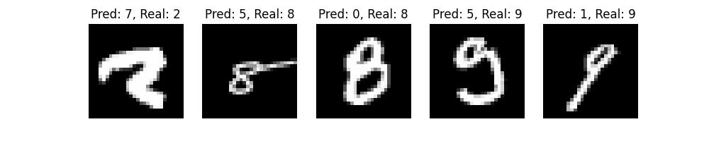

# Deep Vision: Convolutional Neural Networks for Image Classification with MNIST

## 🔬 Overview

**Deep Vision** is a “Hello World” project in deep learning, focused on **building a Convolutional Neural Network (CNN)** to classify handwritten digits using the **MNIST** dataset. Perfect for beginners who want to explore computer vision techniques with a straightforward yet impactful example.

## 🎯 Features

- **Data Loading & Preprocessing:** Quickly load MNIST data and normalize pixel values.
- **CNN Architecture:** Simple CNN (Conv2D, MaxPooling) with Keras/TensorFlow.
- **Training & Evaluation:** Monitor loss & accuracy; view performance via confusion matrix.
- **Visual Insights:** Plot accuracy/loss curves and examine misclassified digits.

## ⚙️ Installation

1. **Clone the repository**  

   ```bash
   git clone https://github.com/YourUserName/deep-vision-cnn-image-classification-mnist.git
   ```

2. **Install dependencies**  

   ```bash
    python -m venv venv
    source venv/bin/activate
    pip install -r requirements.txt
   ```

3. **(Optional) GPU Support:** If you have a compatible GPU, install `tensorflow-gpu` or ensure your TensorFlow version supports GPU.

## 🚀 Usage

1. **Open/Run** `python src/main.py`.
2. **Train** the model using:

   ```python
   model.fit(X_train, y_train, epochs=5, ...)
   ```

3. **Evaluate** on test data to get accuracy/loss.
4. **Visualize** your results with confusion matrix & sample misclassifications.

## 🎉 Results

- Typical training achieves **98%+ accuracy** on the MNIST test set.
- Clear diagnostic visuals (accuracy/loss plots, confusion matrix) for quick performance assessment.

### Accuracy Evolution

Below is the accuracy evolution during training and validation:


### Confusion Matrix

The confusion matrix for the MNIST test set is shown below:


### Misclassified Samples

Here are some examples of misclassified digits:



## 🤝 Contributing

Feel free to open issues or submit pull requests if you have improvements or new ideas!

**Happy Deep Learning!**  
_Made with :heart: and TensorFlow/Keras._