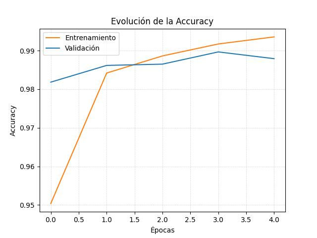
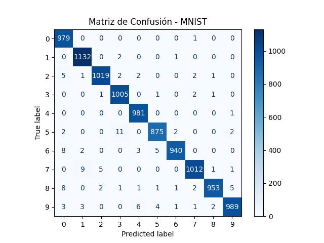

# 🖥️ Deep Vision: Convolutional Neural Networks for Image Classification with MNIST

## 🔬 Overview

**Deep Vision** is a “Hello World” project in deep learning, focused on **building a Convolutional Neural Network (CNN)** to classify handwritten digits using the **MNIST** dataset. Perfect for beginners who want to explore computer vision techniques with a straightforward yet impactful example.

## 🧵 Shroud of Turin Study

As part of this project, we applied the trained model to analyze a digit extracted from an image of the **Shroud of Turin**. The goal was to demonstrate the model's ability to generalize to new, unseen data.


The model successfully predicted the digit present in the image, showcasing its robustness and potential for broader applications.

### 🔍 Misclassified Samples

Here are some examples of misclassified digits:


## 🎯 Features

- 🗂️ **Data Loading & Preprocessing:** Quickly load MNIST data and normalize pixel values.
- 🧠 **CNN Architecture:** Simple CNN (Conv2D, MaxPooling) with Keras/TensorFlow.
- 📊 **Training & Evaluation:** Monitor loss & accuracy; view performance via confusion matrix.
- 📈 **Visual Insights:** Plot accuracy/loss curves and examine misclassified digits.

## ⚙️ Installation

1. **📥 Clone the repository**  

   ```bash
   git clone https://github.com/YourUserName/deep-vision-cnn-image-classification-mnist.git
   ```

2. **📦 Install dependencies**  

   ```bash
    python -m venv venv
    source venv/bin/activate
    pip install -r requirements.txt
   ```

3. **💻 (Optional) GPU Support:** If you have a compatible GPU, install `tensorflow-gpu` or ensure your TensorFlow version supports GPU.

## 🚀 Usage

1. **▶️ Open/Run** `python src/main.py`.
2. **🧑‍🏫 Train** the model using:

   ```python
   model.fit(X_train, y_train, epochs=5, ...)
   ```

3. **📊 Evaluate** on test data to get accuracy/loss.
4. **🔍 Visualize** your results with confusion matrix & sample misclassifications.

## 🎉 Results

- ✅ Typical training achieves **98%+ accuracy** on the MNIST test set.
- 📈 Clear diagnostic visuals (accuracy/loss plots, confusion matrix) for quick performance assessment.

### 📈 Accuracy Evolution

Below is the accuracy evolution during training and validation:



### 📉 Loss Evolution

Below is the loss evolution during training and validation:


### 🧮 Confusion Matrix

The confusion matrix for the MNIST test set is shown below:



## 🤝 Contributing

Feel free to open issues or submit pull requests if you have improvements or new ideas!

**Happy Deep Learning!**  
_Made with :heart: and TensorFlow/Keras._